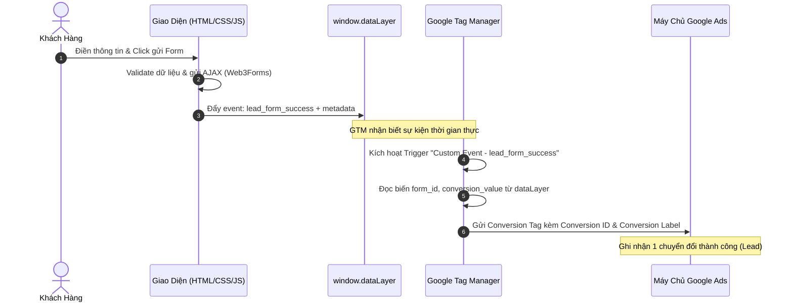

# 📊 Hướng Dẫn Cài Đặt Google Tag Manager & Đo Lường Chuyển Đổi (Conversion Tracking)

Chào mừng bạn đến với tài liệu hướng dẫn **Đo lường Chuyển đổi (Conversion Tracking)**. Để một trang Landing Page hoạt động hiệu quả và mang lại doanh thu, việc thiết kế đẹp và nội dung thuyết phục là chưa đủ. Bạn bắt buộc phải đo lường được hành vi của khách hàng: *Có bao nhiêu người đã vào trang? Có bao nhiêu người bấm nút CTA? Và chính xác có bao nhiêu người đã gửi form đăng ký thành công?*

Để quản lý toàn bộ các mã theo dõi (Meta Pixel, Google Analytics, Google Ads, TikTok Pixel...) một cách tập trung mà không làm nặng code của website, chúng ta sử dụng **Google Tag Manager (GTM)**.

---

## 🛠️ 1. Quy Tắc Yêu Cầu Nhập Mã GTM (GTM ID Input Quality Gate)

Để đảm bảo hệ thống đo lường hoạt động chính xác với đúng tài khoản của học viên, AI Agent **bắt buộc** phải tuân thủ quy tắc kiểm soát chất lượng sau:

> [!WARNING]
> **CỔNG KIỂM SOÁT CHẤT LƯỢNG GTM (GTM QUALITY GATE):**
> 1. **Cấm tự đoán hoặc tự điền GTM ID**: AI Agent tuyệt đối **không** được tự ý điền mã GTM ngẫu nhiên hoặc mặc định vào dự án khi học viên yêu cầu cài đặt.
> 2. **Yêu cầu cung cấp hoặc đọc từ `.env`**: AI Agent phải yêu cầu học viên khai báo mã GTM Container ID (Ví dụ: `GTM-KNKBQR6H`) trong file `.env` ở thư mục gốc dưới biến `gtm_id=GTM-XXXXXXXX`.
> 3. **Tự động trích xuất**: AI Agent sẽ đọc file `.env`, trích xuất giá trị `gtm_id` và thay thế vào các đoạn mã nhúng tương ứng trong `index.html`.
> 4. **Dừng lại nếu thiếu**: Nếu file `.env` chưa có cấu hình `gtm_id`, AI Agent phải dừng quy trình cài đặt và hiển thị yêu cầu: *"Vui lòng bổ sung biến `gtm_id=Mã-GTM-Của-Bạn` (Ví dụ: `gtm_id=GTM-KNKBQR6H`) vào file `.env` để tôi tiến hành tích hợp tự động!"*

---

## 🛠️ 2. Hướng Dẫn Cài Đặt Trực Tiếp Google Tag Manager

Hãy mở tệp tin cấu trúc giao diện chính của bạn (`index.html`) và tiến hành nhúng hai đoạn mã tiêu chuẩn của container (sử dụng mã GTM trích xuất từ `.env`, ví dụ: **GTM-KNKBQR6H**) theo đúng hai vị trí quy chuẩn dưới đây:

### Vị trí 1: Nhúng vào thẻ `<head>` (Càng cao càng tốt)
Đoạn mã JavaScript này giúp kích hoạt GTM ngay khi trang web bắt đầu tải để ghi nhận lượt truy cập của người dùng mà không làm chậm giao diện.

👉 **Cách làm:** Hãy tìm đến thẻ mở `<head>` trong file `index.html` của bạn, và dán đoạn mã sau vào **ngay bên dưới thẻ `<head>`** (ở vị trí cao nhất có thể, trước toàn bộ các thẻ link CSS hay script khác):

```html
<!-- Google Tag Manager -->
<script>(function(w,d,s,l,i){w[l]=w[l]||[];w[l].push({'gtm.start':
new Date().getTime(),event:'gtm.js'});var f=d.getElementsByTagName(s)[0],
j=d.createElement(s),dl=l!='dataLayer'?'&l='+l:'';j.async=true;j.src=
'https://www.googletagmanager.com/gtm.js?id='+i+dl;f.parentNode.insertBefore(j,f);
})(window,document,'script','dataLayer','GTM-KNKBQR6H');</script>
<!-- End Google Tag Manager -->
```

### Vị trí 2: Nhúng vào thẻ `<body>` (Ngay sau thẻ mở <body>)
Đoạn mã noscript này đóng vai trò là lá chắn dự phòng, giúp kích hoạt các mã đo lường trong trường hợp trình duyệt của người dùng tắt JavaScript.

👉 **Cách làm:** Tìm đến thẻ mở `<body>` trong file `index.html` và dán đoạn mã sau vào **ngay phía sau thẻ mở `<body>`**:

```html
<!-- Google Tag Manager (noscript) -->
<noscript><iframe src="https://www.googletagmanager.com/ns.html?id=GTM-KNKBQR6H"
height="0" width="0" style="display:none;visibility:hidden"></iframe></noscript>
<!-- End Google Tag Manager (noscript) -->
```

---

## ⚡ 2. Cách Đo Lường Sự Kiện Đăng Ký Form Thành Công Gửi Lên GTM (Đo lường Chuẩn Senior)

Khi người dùng gửi form đăng ký tư vấn thành công, chúng ta sử dụng phương thức **`dataLayer.push`** của Google để bắn một sự kiện tùy chỉnh (Custom Event) lên GTM. Điều này giúp bạn dễ dàng cài đặt các chiến dịch tối ưu hóa chuyển đổi quảng cáo trên Facebook Ads, Google Ads hay TikTok Ads thông qua GTM.

### 👉 Hướng dẫn tích hợp vào mã JavaScript (`main.js`):
Trong file `main.js` của bạn, tại sự kiện gửi form AJAX thành công đến Web3Forms, hãy bổ sung thêm lệnh bắn sự kiện lên GTM như sau:

```javascript
// Đoạn mã mẫu trong main.js khi gửi form AJAX thành công
if (response.status === 200 && result.success) {
    // 1. Hiển thị thông báo Toast thành công
    showToast();
    
    // 2. [THÊM MỚI] Bắn sự kiện chuyển đổi lên Google Tag Manager dataLayer
    window.dataLayer = window.dataLayer || [];
    window.dataLayer.push({
        'event': 'lead_form_success',          // Tên sự kiện tùy chỉnh bắt trên GTM
        'form_id': 'contact-form',            // ID của biểu mẫu đăng ký
        'conversion_value': 100000            // Giá trị chuyển đổi tượng trưng (nếu có)
    });
    
    // 3. Xóa sạch dữ liệu đã nhập trong form
    contactForm.reset();
}
```

### 🎯 3. Hướng Dẫn Từng Bước Cấu Hình Google Tag Manager (GTM) Để Bắt Sự Kiện `lead_form_success` & Gửi Về Google Ads

Để đo lường chuyển đổi hiệu quả và tối ưu hóa các chiến dịch Smart Bidding của Google Ads, hệ thống tracking cần vận hành trơn tru từ Client-side lên GTM và chuyển tiếp chính xác về máy chủ Google. 

Dưới đây là sơ đồ luồng dữ liệu chuyển đổi và hướng dẫn chi tiết từng bước thiết lập chuẩn Senior.

#### 📊 Sơ Đồ Luồng Hoạt Động (Conversion Data Flow)



---

#### 📋 Danh Sách Dữ Liệu Truyền Tải (Data Schema)

Khi sự kiện `lead_form_success` được kích hoạt, các tham số sau sẽ được đẩy vào bộ nhớ đệm `dataLayer` để GTM sử dụng:

| Tên Trường (Key) | Kiểu Dữ Liệu | Mục Đích Sử Dụng | Ví Dụ Thực Tế |
| :--- | :--- | :--- | :--- |
| `event` | `String` | Khóa nhận diện sự kiện (Trigger Key) trên GTM | `lead_form_success` |
| `form_id` | `String` | Định danh cụ thể form gửi thành công (hữu ích khi landing page có nhiều form) | `contact-form-hero`, `contact-form-footer` |
| `conversion_value` | `Number` | Giá trị chuyển đổi bằng tiền mặt để tính toán ROI/ROAS trực tiếp | `100000` (100k VNĐ) |

---

#### 📌 Bước 3.1: Tạo Trình Kích Hoạt Sự Kiện Tùy Chỉnh (Custom Event Trigger)
Trình kích hoạt này đóng vai trò "lắng nghe" và bắt trọn khoảnh khắc sự kiện `lead_form_success` xuất hiện.

1. Chọn mục **Trình kích hoạt (Triggers)** ở menu bên trái -> Nhấp **Mới (New)**.
2. Đặt tên trình kích hoạt: `Custom Event - Lead Form Success`.
3. Nhấp vào **Cấu hình trình kích hoạt (Trigger Configuration)** -> Chọn loại trình kích hoạt là **Sự kiện tùy chỉnh (Custom Event)**.
4. Tại ô **Tên sự kiện (Event name)**: Nhập chính xác không sai một ký tự: `lead_form_success`.
5. Tại mục *Trình kích hoạt này kích hoạt trên*: Chọn **Tất cả sự kiện tùy chỉnh (All Custom Events)**.
6. Nhấp **Lưu (Save)**.

---

#### 📌 Bước 3.2: Tạo Thẻ Liên Kết Chuyển Đổi (Conversion Linker - Bắt Buộc 100%)
> [!IMPORTANT]
> **TẠI SAO PHẢI CÓ THẺ LIÊN KẾT CHUYỂN ĐỔI?**
> Từ hệ điều hành iOS 14+ và trình duyệt Safari, Apple áp dụng cơ chế bảo mật ITP (Intelligent Tracking Prevention) chặn cookies của bên thứ ba. Thẻ **Conversion Linker** giúp lưu trữ các tham số nhấp chuột quảng cáo (gclid, dclid...) vào cookie của bên thứ nhất (first-party cookie) trực tiếp trên tên miền của bạn, giúp bảo toàn dữ liệu đo lường chính xác tuyệt đối.

1. Chọn mục **Thẻ (Tags)** ở menu bên trái -> Nhấp **Mới (New)**.
2. Đặt tên thẻ: `Conversion Linker`.
3. Nhấp vào **Cấu hình thẻ (Tag Configuration)** -> Chọn loại thẻ là **Liên kết chuyển đổi (Conversion Linker)**.
4. Giữ nguyên toàn bộ cấu hình mặc định (Đảm bảo tùy chọn *Enable linking on all page URLs* được bật).
5. Tại phần **Kích hoạt (Triggering)**: Chọn trình kích hoạt mặc định là **Initialization - All Pages** (Kích hoạt trên tất cả các trang khi bắt đầu).
6. Nhấp **Lưu (Save)**.

---

#### 📌 Bước 3.3: Tạo Thẻ Chuyển Đổi Google Ads (Google Ads Conversion Tracking)
Thẻ này có nhiệm vụ đóng gói dữ liệu và gửi thông tin chuyển đổi về đúng tài khoản Google Ads của bạn.

1. Chọn mục **Thẻ (Tags)** ở menu bên trái -> Nhấp **Mới (New)**.
2. Đặt tên thẻ: `Google Ads - Lead Conversion`.
3. Nhấp vào **Cấu hình thẻ (Tag Configuration)** -> Chọn loại thẻ là **Theo dõi chuyển đổi của Google Ads (Google Ads Conversion Tracking)**.
4. Điền các tham số kết nối từ tài khoản Google Ads:
   - **ID chuyển đổi (Conversion ID)**: Nhập dãy số Conversion ID được cung cấp trong tài khoản Google Ads (Ví dụ: `1122334455`).
   - **Nhãn chuyển đổi (Conversion Label)**: Nhập chuỗi mã ký tự nhãn chuyển đổi tương ứng (Ví dụ: `xYz_AbCdEfGhIjKlMnOp`).
   - **Giá trị chuyển đổi (Conversion Value)**: Nhập một số cụ thể đại diện cho giá trị của một lượt gửi form thành công (Ví dụ: `100000` cho 100k VNĐ), hoặc để trống nếu không muốn tính doanh thu quảng cáo tĩnh.
   - **Mã tiền tệ (Currency Code)**: Nhập mã tiền tệ tương ứng, ví dụ: `VND` hoặc `USD`.
   
   > [!TIP]
   > **Cách lấy Conversion ID và Conversion Label từ Google Ads:**
   > 1. Truy cập vào tài khoản Google Ads của bạn.
   > 2. Vào **Công cụ và cài đặt (Tools & Settings)** -> **Lượt chuyển đổi (Conversions)**.
   > 3. Chọn hành động chuyển đổi của bạn (ví dụ: *Gửi biểu mẫu khách hàng tiềm năng*).
   > 4. Nhấp vào tab **Thiết lập thẻ (Tag Setup)** -> Chọn **Sử dụng Trình quản lý thẻ của Google (Use Google Tag Manager)**.
   > 5. Sao chép chính xác hai thông số **ID chuyển đổi (Conversion ID)** và **Nhãn chuyển đổi (Conversion Label)** được hiển thị trên màn hình.

5. Tại phần **Kích hoạt (Triggering)**: Nhấp chọn trình kích hoạt **Custom Event - Lead Form Success** đã tạo ở Bước 3.1.
6. Nhấp **Lưu (Save)**.

---

#### 📌 Bước 3.4: Kiểm Tra Trong Chế Độ Xem Trước (Preview & Debug) & Xuất Bản
Sau khi đã thiết lập xong, học viên bắt buộc phải kiểm tra kỹ thuật trước khi chạy quảng cáo thực tế:

1. Tại màn hình GTM, nhấp nút **Xem trước (Preview)** ở góc phải trên.
2. Nhập URL trang Landing Page cục bộ hoặc tên miền thực tế (Ví dụ: `http://localhost:8000` hoặc tên miền của bạn) -> Nhấp **Connect**.
3. Thực hiện điền đầy đủ thông tin vào Form đăng ký và bấm gửi thành công.
4. Quay lại cửa sổ **Tag Assistant**:
   - Ở cột danh sách sự kiện bên trái, kiểm tra sự xuất hiện của sự kiện `lead_form_success`.
   - Nhấp vào sự kiện đó và quan sát ở phần **Tags Fired**: Thẻ `Google Ads - Lead Conversion` phải hiển thị trạng thái **Succeeded (Fired)**.
   - Nhấp vào tab **Data Layer** để kiểm tra dữ liệu lớp `lead_form_success` có hiển thị đúng cấu trúc không.
5. Nếu mọi thứ hoạt động hoàn hảo, quay lại cửa sổ Google Tag Manager chính, nhấp nút **Gửi (Submit)** -> Điền tên phiên bản (Ví dụ: `Tích hợp Google Ads Tracking - Lead Form Success`) -> Nhấp **Xuất bản (Publish)** để cập nhật cấu hình lên phiên bản hoạt động thực tế.

---

## 🛡️ 4. Quy Tắc Vàng Kiểm Tra Chất Lượng Cài Đặt (Quality Gates)

Học viên và AI Agent phải tự động kiểm tra chéo các tiêu chí sau trước khi bàn giao:
- [ ] **Đúng vị trí**: Thẻ `<script>` GTM nằm trên cùng của `<head>` và thẻ `<noscript>` nằm ngay sau thẻ mở `<body>`.
- [ ] **Không trùng lặp**: Chỉ cài đặt một bộ container duy nhất (`GTM-KNKBQR6H`), không cài lặp lại nhiều lần gây sai lệch số liệu.
- [ ] **Bảo toàn dữ liệu**: Đảm bảo sự kiện `lead_form_success` được kích hoạt ổn định trên mọi môi trường và dữ liệu được ghi nhận chính xác trên Google Ads Dashboard.

