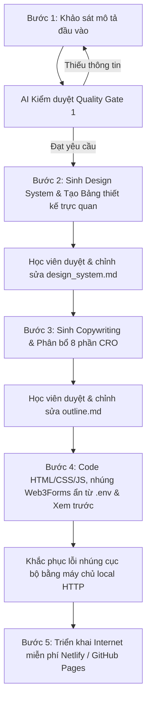

# 📕 Tài Liệu Đặc Tả Kỹ Thuật Chi Tiết (detail_spec.md)
## Quy Trình 5 Bước Kiến Tạo Landing Page Cao Cấp & Bảo Mật

Tài liệu này định nghĩa hệ quy chuẩn tối cao về kiến trúc thư mục, quy trình tương tác 5 bước giữa Học viên và AI Coding Agent, cùng các tiêu chuẩn chất lượng kỹ thuật, bảo mật thông tin và duy trì ngữ cảnh. Tài liệu này đóng vai trò là "Bản đồ lập trình" giúp tạo ra các trang Landing Page tĩnh có tỉ lệ chuyển đổi vượt trội (CRO) và thẩm mỹ UI/UI hiện đại bậc nhất.

---

## 📂 1. Kiến Trúc Thư Mục Hệ Thống (Workspace Architecture)

Để duy trì lịch sử Git sạch sẽ, tránh xung đột mã nguồn và quản lý dự án hiệu quả, toàn bộ không gian làm việc bắt buộc phải được đóng gói gọn gàng. Học viên và AI Agent phải tuân thủ nghiêm ngặt sơ đồ phân bố sau:

### ⚠️ Quy tắc tối cao:
- **Tuyệt đối không** tạo, chỉnh sửa các file mã nguồn của dự án (HTML, CSS, JS) tại thư mục gốc. 
- Mọi tài nguyên thuộc một dự án cụ thể phải nằm trọn vẹn trong một thư mục con duy nhất nằm dưới thư mục `projects/` (ví dụ: `projects/the-smile/`).

### Sơ đồ cấu trúc cây thư mục chuẩn:
```text
Landing_Page/                           # Thư mục gốc không gian làm việc (Root)
├── .env                                # Lưu trữ API key & Token bảo mật (KHÔNG PUSH LÊN GITHUB)
├── .gitignore                          # Cấu hình bỏ qua các file nhạy cảm và file rác hệ thống
├── detail_spec.md                      # Tài liệu đặc tả kỹ thuật chi tiết này (Master Spec)
├── Readme.md                           # Hướng dẫn sử dụng & Mẫu prompt tương tác cho học viên
├── roadmap.md                          # Lộ trình học tập và kiểm tra tiến độ dự án
├── .agents/                            # Thư mục lưu trữ tự động hóa của AI
│   └── workflows/
│       ├── load_context.md             # Quy trình tự động khôi phục trí nhớ (Load Memory)
│       └── save_context.md             # Quy trình tự động sao lưu nhật ký & ngữ cảnh (Save Memory)
├── memory_bank/                        # Ngân hàng bộ nhớ làm việc của dự án (Continuity Bank)
│   ├── project_brief.md                # Tóm tắt mục tiêu, quy chuẩn và tech stack của không gian
│   ├── active_context.md               # Lưu trữ file đang mở, công việc hiện tại và bước tiếp theo
│   └── daily_logs.md                   # Nhật ký chi tiết của từng phiên làm việc (Time-series)
├── Skills/                             # Thư mục chứa các tài liệu kỹ năng cốt lõi
│   ├── LandingPage_Skills.md           # Bộ nguyên tắc thiết kế, CSS Option & CRO Grid 8 phần
│   ├── Conversion_Tracking.md          # Hướng dẫn đo lường chuyển đổi (Ads Pixel/CAPI)
│   └── Skills.md                       # Quy tắc ứng xử chung của AI Agent
├── steps/                              # Các tệp hướng dẫn từng bước của Học viên
│   ├── step1.md                        # Bước 1: Khảo sát ý tưởng đầu vào (first_input.md)
│   ├── step2.md                        # Bước 2: Thiết kế hệ thống (design_system.md)
│   ├── step3.md                        # Bước 3: Phân bổ nội dung phễu thuyết phục (outline.md)
│   ├── step4.md                        # Bước 4: Lập trình HTML/CSS/JS & Xem trước kết quả
│   └── step5.md                        # Bước 5: Triển khai đưa website lên mạng miễn phí (Deploy)
└── projects/                           # Thư mục chứa toàn bộ dự án thực hành của Học viên
    └── [ten-du-an]/                    # Thư mục con tự đóng gói cho mỗi dự án
        ├── first_input.md              # Khảo sát đầu vào đã chốt của dự án
        ├── design_system.md            # Bộ quy chuẩn giao diện (Màu sắc, Font, UI Tokens)
        ├── outline.md                  # Copywriting chi tiết 8 phần chuẩn CRO
        ├── index.html                  # Giao diện cấu trúc HTML5 hoàn thiện (Web3Forms nhúng ẩn)
        ├── style.css                   # Định dạng mỹ thuật Premium (Biến CSS, Sáng/Tối, Responsive)
        ├── main.js                     # Xử lý tương tác động (AJAX Fetch, Đếm số, Menu, Toast)
        └── [ten_du_an]_design_board.png # Ảnh bảng định hướng thiết kế trực quan (Visual Style Tile)
```

---

## 🎯 2. Quy Trình 5 Bước Tương Tác Tuần Tự (The 5-Step Workflow Loop)

Quy trình xây dựng Landing Page được đóng gói thành một phễu 5 bước tuần tự, kiểm soát chất lượng qua từng "Cổng phê duyệt" (Approval Gates). AI Agent chỉ được tiến hành bước tiếp theo khi Học viên đã duyệt và đồng ý.



### 📋 Bước 1: Ý Tưởng Đầu Vào (first_input.md) & Cổng Kiểm Soát Chất Lượng (Quality Gate)
- **Mục tiêu**: Đóng băng các tham số đầu vào định hình thẩm mỹ và mục tiêu dự án.
- **Học viên cung cấp**: 5 thông tin **bắt buộc** trong file `projects/[ten-du-an]/first_input.md`:
  1. **Thương hiệu**: Tên chính thức của doanh nghiệp/thương hiệu.
  2. **Sản phẩm / Dịch vụ**: Mô tả chi tiết giá trị sử dụng và USP cốt lõi.
  3. **Website tham khảo**: Địa chỉ URL của website mẫu để đối chiếu bố cục (Học viên **phải tự điền**, AI **tuyệt đối không** được điền hộ).
  4. **Ngôn ngữ**: Ngôn ngữ hiển thị chính (ví dụ: Tiếng Việt, Tiếng Anh).
  5. **Phong cách website**: Định hướng thẩm mỹ mong muốn (ví dụ: Sáng sủa, Tối giản, Hổ phách...).
- **Quy tắc AI Agent**:
  - **Cấm tự đoán**: Nếu phát hiện file `first_input.md` bị trống bất kỳ thông tin nào trong 5 mục trên, AI Agent **phải dừng lại ngay lập tức** và yêu cầu học viên điền đầy đủ. Không được tự ý phỏng đoán và sinh tiếp Bước 2.

### 🎨 Bước 2: Thiết Kế Hệ Thống (design_system.md) & Visual Style Tile
- **Mục tiêu**: Thiết lập bộ quy chuẩn mỹ thuật kỹ thuật số đồng bộ, nhất quán, ngăn ngừa lỗi hiển thị pha tạp.
- **Hành động của AI**: Tạo file `projects/[ten-du-an]/design_system.md` mô tả:
  - **CSS Variables (:root)**: Định nghĩa rõ ràng màu nền chính, màu nền phụ, màu thẻ, viền thẻ, chữ chính, chữ phụ, màu điểm nhấn và màu hổ phách cảnh báo.
  - **Đồng bộ phong cách (Theme Sync)**: Phải cấu hình hệ biến CSS tương ứng chính xác phong cách đã chọn ở Bước 1. Nếu học viên chọn phong cách sáng sủa (Light Mode), **cấm** pha tạp các màu nền tối hoặc chữ sáng của Dark Mode khiến giao diện bị lỗi hiển thị.
  - **Đồng bộ ngôn ngữ (Language Alignment)**: Toàn bộ tiêu đề, nhãn, chú thích trong file `design_system.md` **bắt buộc** phải viết bằng đúng ngôn ngữ chính đã đăng ký (ví dụ: Tiếng Việt 100%).
  - **Visual Board**: Tạo một ảnh tham chiếu trực quan (Visual Style Tile) đặt tên là `[ten_du_an]_design_board.png` lưu cạnh file markdown để trực quan hóa phong cách.
- **Tương tác**: Học viên trực tiếp duyệt, có quyền tùy chỉnh mã màu HEX/HSL hoặc font chữ Google Fonts trong file `design_system.md` trước khi đi tiếp.

### 📝 Bước 3: Phân Bổ Nội Dung Chuẩn CRO (outline.md)
- **Mục tiêu**: Lên khung sườn copywriting cuốn hút, phân bổ logic theo tâm lý hành vi khách hàng qua phễu lưới 8 phần.
- **Hành động của AI**: Sinh tệp `projects/[ten-du-an]/outline.md` chứa văn bản thuyết phục chi tiết bằng ngôn ngữ chính đã chọn, tuyệt đối không dùng nội dung placeholder (Lorem Ipsum).
- **Cấu trúc Lưới 8 phần CRO**:
  1. **Thanh điều hướng (Navbar)**: Cấu trúc Logo, Anchor links cuộn trang mượt, CTA nhanh "Tư vấn ngay".
  2. **Khu vực mở đầu (Hero)**: Tiêu đề lớn `<h1>` có từ khóa chính `.gradient-text`, thông điệp USP rõ ràng, cặp nút bấm đôi hành động (Primary & Secondary), nhãn micro-trust badges (cam kết bồi thường, thời gian hỗ trợ). **Cột bên phải luôn luôn gợi ý một trình phát video nhúng YouTube mặc định (`https://www.youtube.com/watch?v=RIrJz7NOdKw`)** để tối đa hóa tương tác.
  3. **Số liệu & Đối tác (Impact & Marquee)**: Các chỉ số thành công ấn tượng (năm kinh nghiệm, số lượng khách hàng, tỷ lệ pháp lý) và dải logo thương hiệu đối tác chạy ngang liên tục không điểm dừng (Endless Marquee).
  4. **Danh mục Giải pháp (Products Grid)**: Lưới 3 cột dịch vụ rõ ràng, chi phí minh bạch không ẩn. Có một thẻ nổi bật đặc biệt (Featured Card) được thiết kế lớn hơn để thu hút hành vi lựa chọn.
  5. **Chứng thực & Lợi ích (Social Proof & Perks)**: Bảng chỉ số hiệu quả chứng thực, lưới tick-list các lợi ích vượt trội, CTA hướng phễu về đăng ký.
  6. **Câu chuyện & Năng lực (Storytelling & Skills Matrix)**: Câu chuyện thương hiệu chạm cảm xúc (nỗi đau kế toán cẩu thả gây phạt thuế, sứ mệnh làm tấm khiên bảo vệ), danh mục năng lực chuyên môn chia nhóm rõ ràng, chứng chỉ/đối tác ngân hàng liên kết.
  7. **Chia sẻ giá trị (Blog Grid)**: Lưới bài viết chia sẻ kiến thức chuyên sâu từ Kế toán trưởng để xây dựng uy tín chuyên gia.
  8. **Form thu thập (Lead Gate)**: Thông tin hotline/email/địa chỉ và biểu mẫu đăng ký thông tin khách hàng tiềm năng.
- **Tương tác**: Học viên đọc kỹ file `outline.md` và chỉnh sửa các từ ngữ kêu gọi hành động cho thật sắc bén.

### 💻 Bước 4: Lập Trình Hoàn Thiện & Preview Máy Chủ Cục Bộ (Code & Preview)
- **Mục tiêu**: Hiện thực hóa trang web tĩnh tối giản, hoạt động hoàn hảo, tải trang siêu tốc.
- **Tech Stack yêu cầu**: **Vanilla Web Stack (HTML5 + CSS3 + JS ES6)**. Lập trình thuần túy, tuyệt đối **không** dùng thư viện biên dịch hay đóng gói (Webpack, Vite, Tailwind CSS, React) để đảm bảo học viên chỉ cần đẩy file lên server là chạy ngay lập tức.
- **Tích hợp Form Thu thập không Backend (Web3Forms)**:
  - AI Agent **bắt buộc** phải tự động đọc mã API key `web3forms_Api` được lưu trong file `.env` ở thư mục gốc của không gian làm việc.
  - Tự động nhúng API key này vào thẻ input ẩn trong form đăng ký tại `index.html`:
    ```html
    <input type="hidden" name="access_key" value="1f629fc3-29dd-4793-86b5-8fdfd945373d">
    ```
  - Trong `main.js`, viết sự kiện lắng nghe `submit`, chặn hành vi load lại trang, thực hiện gửi yêu cầu AJAX bất đồng bộ bằng `fetch` tới cổng Web3Forms dưới dạng JSON, sau đó kích hoạt hộp thoại Toast thông báo thành công `#success-toast` cực kỳ hiện đại trong 5 giây rồi xóa sạch form.
- **Đặc tả Khung Video YouTube Hero & Cách xử lý lỗi "Error 153"**:
  - Trình phát video YouTube bên phải Hero section phải được nhúng qua cấu trúc iframe chuẩn hóa:
    ```html
    <div class="hero-video-wrap">
      <div class="hero-video-bg"></div>
      <div class="hero-video-inner">
        <iframe 
          src="https://www.youtube.com/embed/RIrJz7NOdKw?si=ZmVeGphiV9_9OLMg" 
          title="YouTube video player" 
          frameborder="0" 
          allow="accelerometer; autoplay; clipboard-write; encrypted-media; gyroscope; picture-in-picture; web-share" 
          referrerpolicy="strict-origin-when-cross-origin" 
          allowfullscreen>
        </iframe>
      </div>
    </div>
    ```
  - **Mỹ thuật CSS**: Khung chứa video `.hero-video-wrap` phải sử dụng thuộc tính `aspect-ratio: 16 / 9` để giữ đúng tỷ lệ hình học chuẩn, bo viền cong mượt mà `border-radius: 24px`, đổ bóng sâu mềm mại `.hero-video-inner` trên nền đen `#000000`.
  - **Khắc phục lỗi Error 153**: Do chính sách bảo mật Referrer của YouTube, trình phát video nhúng sẽ bị báo lỗi "Error 153: Video player configuration error" nếu người dùng mở file HTML trực tiếp bằng giao thức cục bộ (`file:///.../index.html`). **AI Agent bắt buộc phải hướng dẫn hoặc tự động khởi động một máy chủ web tĩnh cục bộ HTTP (ví dụ chạy ngầm `python3 -m http.server 8000`)** tại thư mục dự án để người dùng truy cập qua đường link `http://localhost:8000`, giúp xác thực tên miền gửi yêu cầu và trình phát video hoạt động bình thường 100%.

### 🚀 Bước 5: Triển Khai Xuất Bản Internet (Deploy)
- **Mục tiêu**: Đưa Landing Page tĩnh lên Internet hoàn toàn miễn phí để kiểm thử thực tế.
- **Hành động của AI**: Hướng dẫn chi tiết học viên thực hiện deploy thông qua 2 giải pháp tối giản nhất:
  1. **Netlify Drop (Kéo & Thả - 10 giây)**: Kéo toàn bộ thư mục dự án `projects/[ten-du-an]/` thả trực tiếp vào giao diện web [Netlify Drop](https://app.netlify.com/drop). Không cần cài đặt phần mềm hay dòng lệnh. Đường dẫn HTTPS trực tuyến được tạo ra ngay lập tức.
  2. **GitHub Pages (Tự động hóa Git)**: Đẩy kho chứa lên GitHub, kích hoạt tính năng GitHub Pages trong Settings của Repository tại nhánh chính `main`. Mỗi khi push code chỉnh sửa mới, website trên mạng tự động cập nhật.

---

## 🛡️ 3. Lá Chắn Bảo Mật & Quy Tắc An Toàn Thông Tin (Security Shield Gates)

Để đảm bảo các thông tin nhạy cảm của Học viên (token quản trị, API keys bảo mật) không bao giờ bị rò rỉ ra công chúng trên các kho mã nguồn mở như GitHub:

1. **Bắt buộc cấu hình `.gitignore`**:
   - Mọi không gian làm việc phải sở hữu tệp `.gitignore` ở thư mục gốc ghi nhận rõ ràng:
     ```text
     .env
     .DS_Store
     *.log
     ```
   - Tệp `.env` lưu trữ `web3forms_Api`, `Git-hub-admin-token` tuyệt đối **không** được phép đưa vào danh sách theo dõi của Git (Git index).
2. **Cấu hình Git nội bộ cục bộ (Local config)**:
   - Khi đẩy code lên GitHub, AI Agent phải hướng dẫn thiết lập cấu hình Git cục bộ trong thư mục làm việc (Local config) thay vì cấu hình toàn cục (Global config) để bảo vệ thông tin cá nhân:
     ```bash
     git config --local user.name "tên-github"
     git config --local user.email "email-đăng-ký"
     ```
3. **Mã hóa nhúng an toàn**:
   - Sử dụng định dạng tham số `?si=...` và `referrerpolicy="strict-origin-when-cross-origin"` trên tất cả các tài nguyên nhúng bên ngoài (như YouTube) để bảo vệ quyền riêng tư người dùng.
4. **Quy tắc Đẩy code lên GitHub (Push Request Only)**:
   - AI Agent **tuyệt đối không** tự ý chạy các lệnh `git push` để đẩy mã nguồn lên GitHub nếu **chưa nhận được yêu cầu cụ thể và trực tiếp** từ học viên. Học viên có toàn quyền kiểm soát lịch sử commit của kho lưu trữ.

---

## 🧠 4. Quy Trình Duy Trì Ngữ Cảnh Hoạt Động (Memory Bank Continuity Workflows)

Để ngăn chặn hiện tượng mất trí nhớ hoặc sinh code sai lệch ("ảo giác") của AI Agent khi bắt đầu một phiên làm việc mới, không gian làm việc tích hợp cơ chế **Memory Bank** tự động hóa thông qua 2 tệp kịch bản đặc biệt trong `.agents/workflows/`:

### 🔄 A. Kịch bản Tải Ngữ Cảnh (`load_context.md`)
Khi bắt đầu phiên học hoặc khi có lệnh `/load_context` từ Học viên, AI Agent **phải**:
1. Đọc tệp Tóm tắt dự án `memory_bank/project_brief.md` để hiểu sâu về mục tiêu và quy chuẩn kỹ thuật của không gian làm việc.
2. Đọc tệp Ngữ cảnh hoạt động `memory_bank/active_context.md` để biết chính xác file nào đang được chỉnh sửa, các tác vụ dở dang và bước tiếp theo.
3. Đọc tệp Nhật ký hoạt động `memory_bank/daily_logs.md` để nắm được lịch sử các quyết định kỹ thuật và lỗi đã sửa gần đây.
4. Lập báo cáo khôi phục ngữ cảnh (Bao gồm: Mục tiêu hiện tại, Lịch sử vừa hoàn thành, Đầu việc sắp thực hiện).
5. **Dừng lại xin ý kiến**: Đưa ra câu hỏi xác nhận chính thức: *"Mọi thông tin memory đã chính xác chưa? Tôi có thể tiến hành các bước tiếp theo ngay lập tức không?"*. AI Agent **tuyệt đối không** được viết code khi học viên chưa phản hồi đồng ý.

### 💾 B. Kịch bản Lưu Ngữ Cảnh (`save_context.md`)
Khi kết thúc phiên làm việc hoặc có lệnh `/save_context` từ Học viên, AI Agent **phải**:
1. Đảm bảo thư mục `memory_bank/` đã được tạo.
2. Ghi đè tệp `memory_bank/active_context.md` cập nhật danh sách tệp đang mở và chỉ dẫn bước tiếp theo rõ ràng cho AI phiên sau.
3. Nối nhật ký (append) vào tệp `memory_bank/daily_logs.md` ghi nhận rõ ngày giờ, danh sách các việc đã làm xong và các quyết định kỹ thuật/ràng buộc mới phát sinh.
4. Hướng dẫn học viên chạy lệnh Git add & Git commit để đồng bộ hóa kho lưu trữ ngữ cảnh lên GitHub an toàn.

---

## 🎨 5. Tiêu Chuẩn Chất Lượng Giao Diện Cao Cấp (Aesthetic Quality Gates)

Để trang Landing Page đạt được chất lượng mỹ thuật "Wow" ngay từ cái nhìn đầu tiên, AI Agent phải tuân thủ nghiêm ngặt các quy tắc thiết kế giao diện sau:

- **Hệ phông chữ tương phản**: Outfit Bold sừng sững cho toàn bộ thẻ tiêu đề H1-H3; Inter Medium/Regular sạch sẽ, sắc nét cho toàn bộ văn bản mô tả, nút bấm và form nhập liệu.
- **Responsive Fluidity**:
  - Không sử dụng các kích thước chiều cao hoặc chiều rộng pixel cứng nhắc cho các container chính.
  - Sử dụng hệ lưới co giãn `flex` hoặc `grid` kết hợp hàm `clamp()` và đơn vị responsive (`rem`, `vh`, `vw`, `%`).
  - Menu hamburger di động phải hoạt động trượt mượt mà, kích thước vùng chạm nút bấm tối thiểu `44px` để tối ưu trải nghiệm ngón tay trên điện thoại.
- **Glassmorphism & Soft Shadows**:
  - Tận dụng hiệu ứng kính mờ (`backdrop-filter: blur(12px); background-color: rgba(255,255,255,0.85)`) cho thanh điều hướng Navbar để tạo độ sâu thị giác cao cấp.
  - Các thẻ `.clean-card` phải sở hữu bóng đổ siêu mịn (`box-shadow: 0 10px 30px rgba(30, 64, 175, 0.04)`) và chuyển động trượt nhẹ khi hover (`transform: translateY(-6px)`).
- **Tuyệt đối không dùng Placeholders**: Tất cả hình ảnh trong dự án mẫu phải sử dụng hình ảnh thực tế chất lượng cao, các liên kết nhúng hoạt động trực tiếp, không sử dụng đường dẫn cục bộ trên máy tính của AI làm ảnh hưởng đến tính tổng quan của mã nguồn khi học viên khác tải về.
