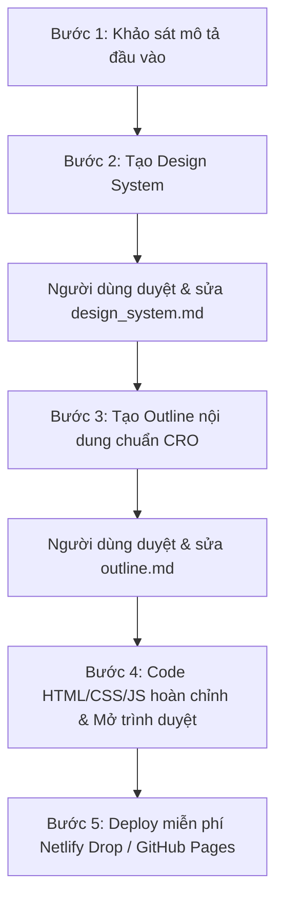

# Tài liệu Kỹ thuật Chi tiết: Quy trình Xây dựng Landing Page 5 Bước

Tài liệu này định nghĩa tiêu chuẩn cấu trúc thư mục, quy trình làm việc tương tác, và hướng dẫn kỹ thuật dành cho học viên và AI Coding Agent để tạo ra các Landing Page cao cấp, chuẩn CRO (Tối ưu hóa chuyển đổi) và chuẩn UX/UI.

---

## 1. Quy tắc Tổ chức Thư mục (Workspace Architecture)

Để đảm bảo không gian làm việc sạch sẽ, dễ quản lý mã nguồn và lịch sử Git, toàn bộ các dự án được tạo ra bởi học viên bắt buộc phải tuân thủ quy tắc đóng gói:

> [!IMPORTANT]
> **Quy tắc tuyệt đối:** Không tạo hoặc chỉnh sửa bất kỳ file dự án nào ở thư mục gốc (root). Tất cả các tệp tin sản phẩm phải được đặt bên trong một thư mục con của `projects/`.

### Cấu trúc Thư mục Dự án chuẩn:
```text
Landing_Page/
├── LandingPage_Skills.md       # Bộ nguyên tắc/kỹ năng thiết kế cốt lõi
├── Skills.md                   # Bộ quy tắc ứng xử chung của AI
├── Readme.md                   # Hướng dẫn sử dụng tổng quan cho học viên
├── detail_spec.md              # Tài liệu kỹ thuật chi tiết này
├── roadmap.md                  # Sơ đồ và tiến trình học tập
├── steps/                      # Các tệp hướng dẫn từng bước học tập
│   ├── step1.md                # Bước 1: Khảo sát ý tưởng (first_input.md)
│   ├── step2.md                # Bước 2: Thiết kế hệ thống (design_system.md)
│   ├── step3.md                # Bước 3: Phân bổ nội dung (outline.md)
│   ├── step4.md                # Bước 4: Lập trình hoàn thiện (HTML/CSS/JS)
│   └── step5.md                # Bước 5: Triển khai Landing Page lên Internet
└── projects/                   # Thư mục chứa các dự án của học viên
    └── [ten-du-an-cua-ban]/    # Thư mục con tự đóng gói cho mỗi dự án
        ├── design_system.md    # Bản phác thảo Thiết kế Hệ thống (Bước 2)
        ├── outline.md          # Bản phác thảo Nội dung & CRO (Bước 3)
        ├── index.html          # File cấu trúc HTML hoàn thiện (Bước 4)
        ├── style.css           # File định dạng giao diện hoàn thiện (Bước 4)
        └── main.js             # File xử lý tương tác hoàn thiện (Bước 4)
```

---

## 2. Quy trình Tương tác 5 Bước Chi tiết (Interaction Flow)

Quy trình xây dựng Landing Page được chia làm 5 bước tuần tự để đảm bảo kiểm soát chất lượng từ ý tưởng đến giao diện thực tế và xuất bản trên mạng.



### Bước 1: Khảo sát Mô tả Đầu vào (Description Intake)
- **Mục tiêu**: Thu thập đầy đủ dữ liệu định hướng ban đầu từ học viên.
- **Học viên cần cung cấp**:
  1. **Sản phẩm & Dịch vụ**: Tên sản phẩm, mô tả chi tiết, giá trị độc bản (USP), đối tượng khách hàng mục tiêu.
  2. **Phong cách giao diện**: Sở thích thiết kế (ví dụ: Sleek Dark Mode, Light Minimalist, High-tech Futuristic, Premium Editorial...).
  3. **Ngôn ngữ**: Tiếng Việt hoặc Tiếng Anh (hoặc đa ngôn ngữ).
- **Hành động của AI**: Phân tích thông tin, đặt câu hỏi làm rõ nếu dữ liệu quá sơ sài, chuẩn bị các mẫu tương ứng.

### Bước 2: Tạo Bản sắc Thiết kế (Design System Generator)
- **Mục tiêu**: Xây dựng nền tảng mỹ thuật đồng bộ, cá nhân hóa theo phong cách yêu cầu của học viên và tuân thủ các chỉ dẫn thẩm mỹ nâng cao.
- **Hành động của AI**:
  - Tạo thư mục dự án mới: `projects/[ten-du-an]/`.
  - Tạo file `projects/[ten-du-an]/design_system.md` mô tả chi tiết hệ thống thiết kế:
    - **Color Palette**: Bảng màu chủ đạo, màu phụ trợ, màu tương phản (mã màu HEX/HSL rõ ràng kèm theo hiệu ứng phát sáng - Glow).
    - **Typography Mood**: Chọn cặp Font chữ từ Google Fonts (ví dụ: Outfit cho tiêu đề + Inter cho nội dung) kèm cỡ chữ, độ đậm (weight).
    - **UI Components**: Bản thiết kế các nút bấm (CTAs), thẻ hiển thị (cards), ô nhập liệu (inputs).
    - **Animation Mood**: Các chuyển động tinh tế (Pulse, Infinite Marquee, Scroll Reveal).
    - **Grid System**: Bố cục căn lề và khoảng cách chuẩn (padding/margin).
- **Tương tác**: Học viên mở file `design_system.md` lên đọc, trực tiếp chỉnh sửa các tông màu hoặc font chữ mong muốn trước khi chuyển sang bước tiếp theo.

### Bước 3: Phân bổ và Soạn thảo Nội dung (CRO Content Outline)
- **Mục tiêu**: Thiết lập cấu trúc nội dung có tính thuyết phục cao, dẫn dắt khách hàng qua phễu chuyển đổi dựa trên cấu trúc 8 phần tại [LandingPage_Skills.md](Skills/LandingPage_Skills.md).
- **Hành động của AI**:
  - Tạo file `projects/[ten-du-an]/outline.md` chứa toàn bộ copywriting chuẩn CRO dựa trên ngôn ngữ học viên đã chọn:
    - **Section 1: Navbar** (Đầu trang, các liên kết neo điều hướng, CTA nhanh).
    - **Section 2: Hero** (Thông điệp tiêu đề H1 cuốn hút, mô tả USP, cụm nút bấm hành động đôi, biểu tượng uy tín nhanh).
    - **Section 3: Impact Counter & Logo Marquee** (Số liệu thống kê nhảy số ấn tượng, dải logo đối tác/khách hàng chạy liên tục).
    - **Section 4: Product Grid** (Lưới giới thiệu sản phẩm/dịch vụ, thẻ nổi bật lớn).
    - **Section 5: Community & Social Proof** (Nội dung chứng thực, bảng chỉ số thành viên/hài lòng, nút tham gia).
    - **Section 6: Storytelling & Category Tags** (Câu chuyện thương hiệu, chứng chỉ/bằng cấp, lưới thẻ phân loại kỹ năng/tính năng).
    - **Section 7: Blog & Thought Leadership** (Các bài viết chia sẻ kiến thức tăng uy tín).
    - **Section 8: Contact Form** (Thông tin liên hệ trực tiếp, form nhập liệu chuẩn FormSubmit).
- **Tương tác**: Học viên đọc bản thảo copywriting trong `outline.md`, chỉnh sửa câu chữ hoặc thứ tự các phần cho đúng ý.

### Bước 4: Lập trình Hoàn thiện & Xem Kết quả (Code & Preview)
- **Mục tiêu**: Chuyển đổi toàn bộ thiết kế ở Bước 2 và nội dung ở Bước 3 thành trang web hoàn chỉnh, có khả năng chạy độc lập trên trình duyệt sử dụng Vanilla Static Web Stack (HTML5, CSS3, JS ES6) cực nhẹ, không cần build biên dịch để deploy tức thì.
- **Hành động của AI**:
  - Đọc file `.env` tại thư mục gốc lấy API key `web3forms_Api`.
  - Đọc kỹ `design_system.md` và `outline.md` trong thư mục dự án sau khi học viên đã duyệt/sửa.
  - Lập trình hoàn chỉnh 3 file:
    1. `projects/[ten-du-an]/index.html` (Cấu trúc HTML5 chuẩn SEO, tự động nhúng mã Web3Forms ẩn từ `.env`).
    2. `projects/[ten-du-an]/style.css` (Xây dựng hệ thống biến CSS dựa trên design system, bóng đổ mờ sáng sủa, responsive @media toàn diện).
    3. `projects/[ten-du-an]/main.js` (Các tương tác menu hamburger, bộ đếm số, reveal, và sự kiện AJAX submit gửi form Web3Forms mượt mà không reload).
  - Tự động chạy lệnh mở trình duyệt để hiển thị kết quả cho học viên (ví dụ: lệnh terminal `open projects/[ten-du-an]/index.html` trên macOS).

### Bước 5: Triển Khai Landing Page lên Internet (Deploy)
- **Mục tiêu**: Xuất bản trang web của học viên lên mạng internet hoàn toàn miễn phí, có HTTPS bảo mật để chia sẻ thực tế.
- **Hành động của AI**: Hướng dẫn học viên chi tiết 2 giải pháp deploy tối ưu:
  1. **Netlify Drop**: Kéo thả trực tiếp thư mục con dự án `projects/[ten-du-an]/` lên Netlify Drop để xuất bản web trong 10 giây không cần cài đặt.
  2. **GitHub Pages**: Đẩy mã nguồn lên GitHub, kích hoạt GitHub Pages tại phần Settings nhánh chính để tự động hóa cập nhật khi push code mới.

---

## 3. Các Tiêu chuẩn Chất lượng Bắt buộc (Quality Gates)

Khi thực thi code ở Bước 4, AI Agent phải tuân thủ nghiêm ngặt các tiêu chuẩn chất lượng sau:

1. **Hiển thị Đáp ứng (Responsive Excellence)**:
   - Mobile (`max-width: 767px`): Cột xếp chồng, thanh menu hamburger hoạt động mượt, khoảng cách chạm nút tối thiểu 44px.
   - Tablet (`768px - 1023px`): Cân đối lại khoảng cách padding và lưới thẻ.
   - Desktop (`1024px trở lên`): Giao diện 2 cột hoặc lưới 3 cột tiêu chuẩn.
2. **Không Dùng Placeholder**: Mọi hình ảnh phải dùng hình ảnh minh họa thực tế hoặc tạo ảnh chất lượng cao qua tool `generate_image`, tuyệt đối không dùng link ảnh rác hoặc để trống.
3. **Hiệu suất & Tương thích**:
   - Sử dụng CSS thuần tối đa, không lạm dụng các thư viện ngoài trừ Google Fonts và Lucide Icons (nếu cần).
   - Tối ưu hóa hiệu ứng chuyển động để đạt điểm số hiệu năng cao nhất trên trình duyệt.
