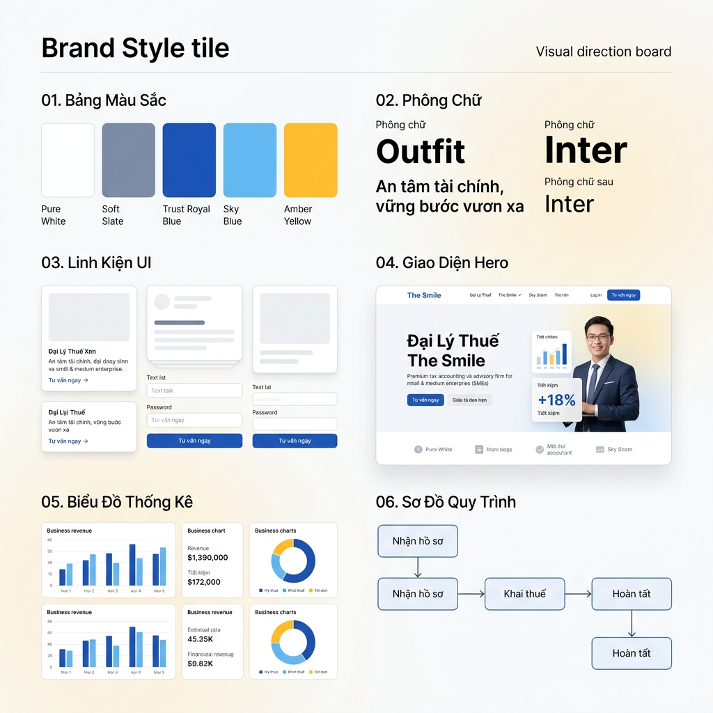

# 🎨 Hệ thống Thiết kế Giao diện - The Smile (design_system.md)



- **Dự án**: The Smile - Dịch vụ Kế toán & Đại lý Thuế
- **Phong cách chủ đạo**: Premium Light Mode (Giao diện sáng sủa, hiện đại) kết hợp cùng hiệu ứng đổ bóng mềm mại (Soft Shadows) và kính mờ sáng tinh tế.
- **Mục tiêu**: Tạo cảm giác an tâm tuyệt đối, uy tín chuyên nghiệp, đồng thời thể hiện tốc độ phản hồi nhanh chóng, năng động và tận tâm chu đáo.

---

## 1. Bảng Màu Hệ Thống (Color Palette)

Hệ màu được thiết kế đồng bộ 100% theo phong cách sáng, sử dụng màu xanh dương hoàng gia làm màu chủ đạo đại diện cho uy tín pháp lý, kết hợp cùng các chi tiết điểm xuyết màu vàng hổ phách mang lại cảm giác thân thiện:

| Vai trò | Tên màu tiếng Việt | Mã màu (HEX / HSL) | Ý nghĩa & Ứng dụng thực tế |
| :--- | :--- | :--- | :--- |
| **Nền chính** | Trắng Tinh Khiết | `#ffffff` / `hsl(0, 0%, 100%)` | Nền tảng chủ đạo, tạo không gian sáng sủa và sạch sẽ. |
| **Nền phụ** | Xám Nhạt Slate | `#f8fafc` / `hsl(210, 40%, 98%)` | Dùng cho các phần (sections) xen kẽ để tạo chiều sâu thị giác. |
| **Nền thẻ** | Thẻ Trắng Sạch | `#ffffff` / `hsl(0, 0%, 100%)` | Nền của các thẻ dịch vụ, kết hợp bóng đổ để nổi bật. |
| **Viền thẻ** | Viền Xám Nhạt | `#e2e8f0` / `hsl(214, 32%, 91%)` | Đường kẻ viền mỏng tạo ranh giới sắc nét cho các khối hộp. |
| **Màu chính (Điểm nhấn)**| Xanh Dương Hoàng Gia| `#1e40af` / `hsl(224, 76%, 40%)` | Đại diện cho chuyên môn kế toán vững vàng, sự uy tín và an tâm pháp lý. |
| **Màu phụ (Tương tác)**| Xanh Da Trời Năng Động| `#0ea5e9` / `hsl(199, 89%, 48%)` | Thể hiện tính công nghệ, phản hồi nhanh và số hóa quy trình. |
| **Màu điểm xuyết** | Vàng Hổ Phách | `#facc15` / `hsl(47, 95%, 53%)` | Màu vàng điểm xuyết rực rỡ đại diện cho sự chu đáo và nhắc nhở thuế. |
| **Chữ chính** | Xám Than Sẫm | `#0f172a` / `hsl(222, 47%, 11%)` | Đảm bảo độ tương phản cao và rõ nét nhất trên nền sáng. |
| **Chữ phụ** | Xám Mờ Slate | `#475569` / `hsl(215, 16%, 33%)` | Dành cho mô tả phụ và nhãn chú thích nhỏ. |

### Hệ Biến CSS Biểu Diễn (CSS Variables):
```css
:root {
  --bg-main: #ffffff;
  --bg-secondary: #f8fafc;
  --bg-card: #ffffff;
  --border-card: #e2e8f0;
  --text-primary: #0f172a;
  --text-secondary: #475569;
  --color-primary: #1e40af;
  --color-primary-glow: rgba(30, 64, 175, 0.05);
  --color-secondary: #0ea5e9;
  --color-accent: #facc15;
  --card-shadow: 0 10px 30px rgba(30, 64, 175, 0.04);
  --transition-smooth: all 0.3s cubic-bezier(0.4, 0, 0.2, 1);
}
```

---

## 2. Phông Chữ Tiêu Chuẩn (Typography Mood)

Sự kết hợp hoàn hảo giữa phông chữ hình học tiêu đề hiện đại và phông chữ nội dung có độ hiển thị cao trên nền sáng:

- **Phông chữ Tiêu đề (Headings - `<h1>`, `<h2>`, `<h3>`)**: **Outfit** (Sans-serif)
  - *Đặc tính*: Hiện đại, vững chãi, tạo cảm giác uy tín và đáng tin cậy.
  - *Độ đậm*: `600` (Semi-bold), `700` (Bold), `800` (Extra-bold).
- **Phông chữ Nội dung (Body, Buttons, Inputs)**: **Inter** (Sans-serif)
  - *Đặc tính*: Tối giản, trung tính, cực kỳ sắc nét trên mọi loại màn hình.
  - *Độ đậm*: `300` (Light), `400` (Regular), `500` (Medium).

---

## 3. Hệ Thống Linh Kiện Giao Gần (UI Components CSS)

### A. Thẻ Sạch Tinh Tế (Clean Shadow Card)
- **CSS Styles**:
  ```css
  .the-sach-tinh-te {
      background: var(--bg-card);
      border: 1px solid var(--border-card);
      border-radius: 20px;
      box-shadow: var(--card-shadow);
      transition: var(--transition-smooth);
  }
  .the-sach-tinh-te:hover {
      transform: translateY(-6px);
      border-color: rgba(30, 64, 175, 0.2);
      box-shadow: 0 16px 36px rgba(30, 64, 175, 0.06);
  }
  ```

### B. Nút Hành Động Ấn Tượng (CTA Buttons)
- **Nút Hành động Chính (Primary CTA)**: Sử dụng dải màu gradient từ Xanh dương sang Xanh da trời, bo tròn đầy đủ (`border-radius: 99px`), có bóng đổ phát sáng xanh nhẹ khi hover.
  - *Hover*: `transform: scale(1.05); box-shadow: 0 6px 20px rgba(30, 64, 175, 0.25);`
- **Nút Hành động Phụ (Secondary CTA)**: Nền trắng tinh khiết, viền mảnh xám xanh nhạt.
  - *Hover*: Nền chuyển nhẹ sang màu xanh dương nhạt (`#eff6ff`), bo viền rực sáng xanh dương hoàng gia.

### C. Khung Nhập Liệu Tiêu Chuẩn (Form Inputs)
- **CSS Styles**:
  ```css
  .khung-nhap-lieu {
      background: #ffffff;
      border: 1px solid #cbd5e1;
      border-radius: 12px;
      padding: 14px 18px;
      color: var(--text-primary);
      transition: var(--transition-smooth);
  }
  .khung-nhap-lieu:focus {
      outline: none;
      border-color: var(--color-primary);
      box-shadow: 0 0 10px rgba(30, 64, 175, 0.1);
  }
  ```

---

## 4. Chuyển Động & Tương Tác Vi Mô (Animations & Micro-interactions)

1. **Hiệu ứng Điểm Nhấn Hổ Phách (Amber Pulse)**:
   - Các biểu tượng cảnh báo thuế hoặc badge ưu đãi sử dụng viền màu vàng hổ phách và có chuyển động thở nhẹ (`pulse` animation) để thu hút chú ý một cách tự nhiên.
2. **Scroll Reveal (Cuộn xuất hiện)**:
   - Áp dụng hiệu ứng mờ dần và trượt nhẹ từ dưới lên trên (`translateY(20px) ➔ translateY(0)`) cho các phần nội dung khi cuộn màn hình tới nơi.
3. **Marquee Loop (Dải Logo cuộn vô hạn)**:
   - Chuyển động ngang tuyến tính liên tục, cực kỳ mượt mà dành cho danh sách logo các doanh nghiệp đối tác tại Section 3.

---

## 5. Quy Chuẩn Bố Cục (Layout & Spacing)

- **Độ rộng Container tối đa**: `1200px` (Đảm bảo cân đối tỷ lệ hiển thị trên màn hình rộng).
- **Khoảng cách giữa các Phần (Section Spacing)**: 
  - Máy tính để bàn (Desktop): `padding-top: 100px; padding-bottom: 100px;` (Không gian thở cao cấp).
  - Điện thoại di động (Mobile): `padding-top: 60px; padding-bottom: 60px;`
